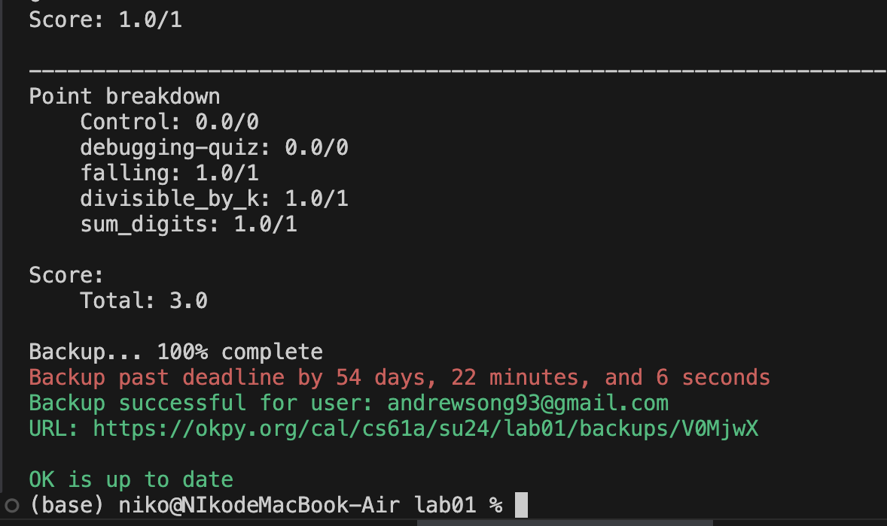
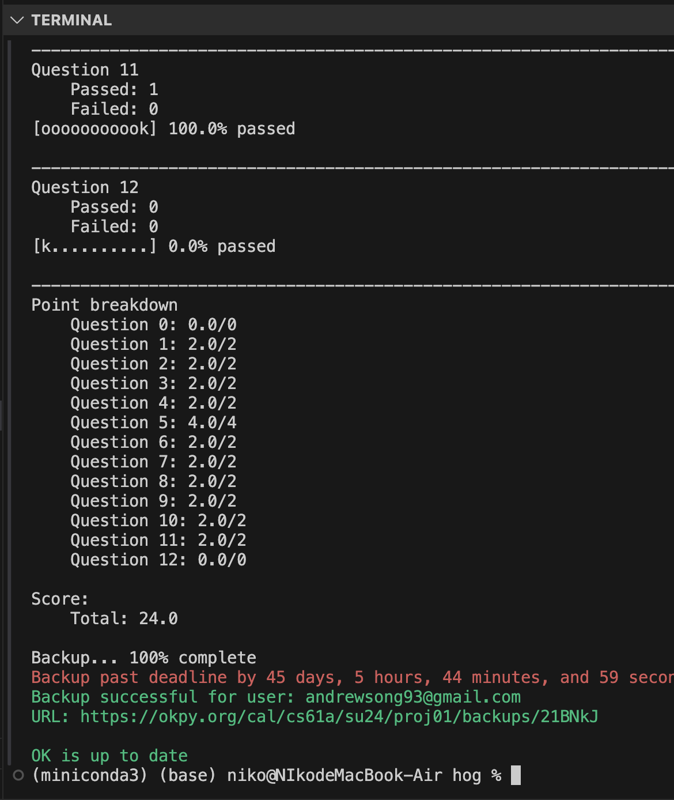
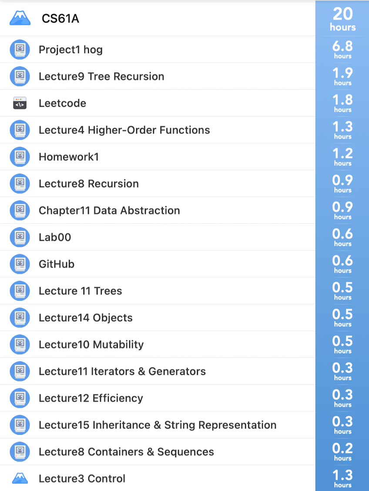
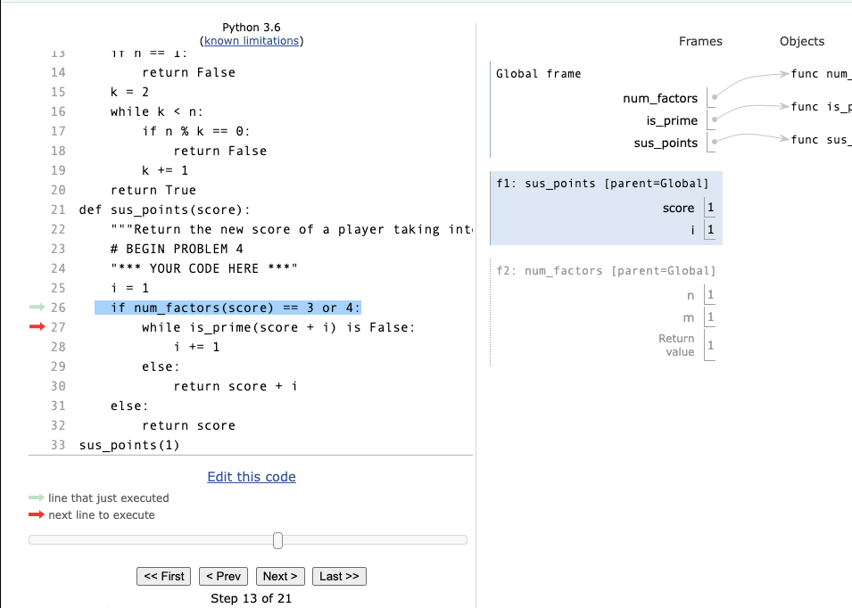
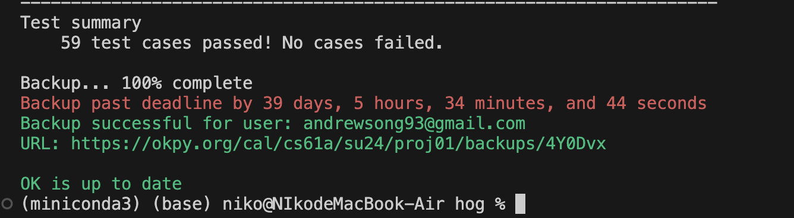
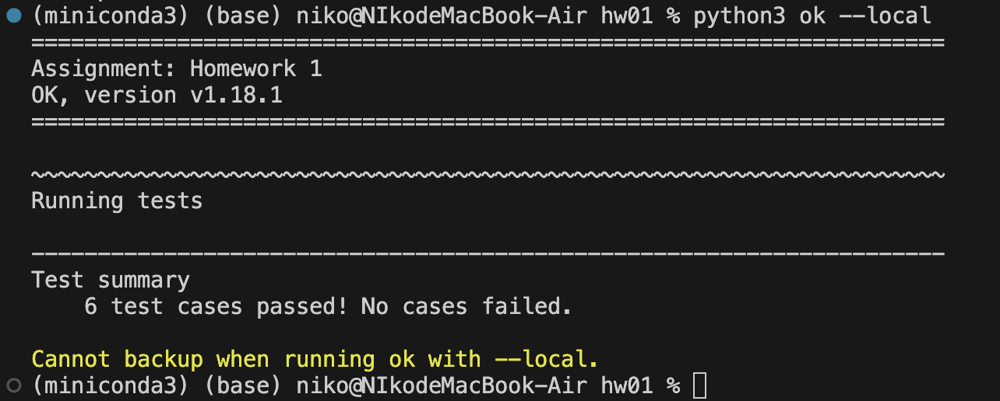

# cs61a-summer2024
study notes of ucb cs61a-summer2024 Structure and Interpretation of Computer Programs


**2024/09/12**
- cs61a DAY28
- Finished: HW05: Generators
- Time cost: 1.5h
- Course Lecture(12th week):Finished 26 scheme, 27 scheme lists, 28 calculator

**2024/09/11**
- cs61a DAY27
- Finished: Lab08: Mutable Trees
- Time cost: 2.4h
- Finished: HW06: OOP, Linked Lists
- Time cost: 2.3h
- Finished: HW04: Sequences, ADT Trees
- Time cost: 1.5h


**2024/09/10**
- cs61a DAY26
- Finished: Lab07: Lab 7: Inheritance, Linked Lists
- Time cost: 2.0h


**2024/09/06**
- cs61a DAY24
- Finished: Lab06: Obeject Oriented Programming
- Time cost: 3.5h


**2024/09/04**
- cs61a DAY22
- Finished: Lab05: Mutability, Iterators 
- Time cost: 3.5h
- Really good lab design, finished all the question(optional included) and got a better understanding of "Mutability and Iterators", actually these concepts are used in Project2-cats.


**2024/09/04**
- cs61a DAY21
- Finished: Project2-Cats 
- Time cost: 10h
- Spent more time than project1, wish I could finish project with less time. 


**2024/09/03**
- cs61a DAY20
- Finished:
        - Lab03: Recursion,List,List Comprehension  
          - Time cost:0.9h  
        - Lab04: Tree Recursion, Data Abstraction  
          - Time cost:1.9h  
- Lab03 is easier than homework03. Eager to finish the last question of lab03, I got up at 4:30am today and spent about 10 minutes finshed it, this feeling is quite good!  
- Lab04's Dictionaries and Data Abstraction are not difficult, most time spent on "Q3: Buying Fruit", still trying hard to solve every Recursion question!  

**2024/09/02**
- cs61a DAY19  
- Finished HW03:Recursion  
- Time cost: 4h  
- Spent quite a lot time on the topic of Recursion. Try to understand amazing recursive leap of faith!  

**2024/08/31**
- cs61a DAY17  
- Finished HW02:Higher-order Functions  
- Time cost: 0.6h  


**2024/08/30**
- cs61a DAY16  
- Finished Lab02  
- Time cost: 2.3h.  
- It's been ten days since last update, cause I just finished my three examinations at August(Epidemiology/Image analysis and Understanding/Fundamental concepts of statistics). I really had an intensive summer vacation. I also improved my understanding of Deep learning/Statistics/Causality through this summer, the first academic year I finished 13 Courses and two semesters'German course. But I also find that I have forgotten some knowledge about cs61a and 61b, maybe I should do a quick recap of what I have learned ten days ago.  

**2024/08/19**  
- Lab01:Functions, Control.  
- Finished [Lab01:Functions, Control.](**https://cs61a.org/lab/lab01/**) 
- 
- time cost: 1.2h.  


**2024/08/17**  
- Project1-Hog Finished, all points got.  
- Finished [project1 problem 8-11.](**https://cs61a.org/hw/sol-hw01/**) 
- 
- time cost: 2.2h.
- 
- time cost for project1:6.8h

**2024/08/12** 
- Finished [project1 problem2-5.](**https://cs61a.org/hw/sol-hw01/**) Spent some time to debug an error in problem4 but found when trying to solve problem5.  
- 
```
if num_factors(score) == 3 or 4:
```  
- this syntax will cause the condition to always be True because 4 itself is a non-zero value, which is considered True in Python. 
- time cost: 1.9h.


**2024/08/11**
- Finished Lecutre_objects.  
- Finished [project1 problem1.](**https://cs61a.org/hw/sol-hw01/**) Spent quite some time to understand question description(I thought I could finish the first question in 5 minutes!), the  good point is that I deepen my understanding of high order function through this process.  
- Test record:  
- 
- time cost: 1h. 


**2024/08/10**
- Finished [project1 problem6-7](**https://cs61a.org/hw/sol-hw01/**)  
- time cost: 1.7h.  

```
(miniconda3) (base) niko@NIkodeMacBook-Air hog % python3 ok -q 07
=====================================================================
Assignment: Project 1: Hog
OK, version v1.18.1
=====================================================================

~~~~~~~~~~~~~~~~~~~~~~~~~~~~~~~~~~~~~~~~~~~~~~~~~~~~~~~~~~~~~~~~~~~~~
Running tests

---------------------------------------------------------------------
Test summary
    9 test cases passed! No cases failed.

Backup... 100% complete
```


**2024/08/09**
- Finished [hw01](https://cs61a.org/hw/sol-hw01/)  
- time cost: 1.2h.  
- Test record:  
-   
- Different solution for question Q3: Largest Factor:  
- solution1(official website): highly efficient, only need to calculate the largest factor and return the number.  
```
factor = n - 1
    while factor > 0:
        if n % factor == 0:
            return factor
        factor -= 1
```  
mine:  not efficient, but can store factors in the list
```
    m = []
    for i in range(1, n-1):
        if n % i ==0 :
            m.append(i)
    return max(m)

```
**2024/08/09**
- Finished [lab00](https://cs61a.org/lab/lab00/)  
- time cost: 5min